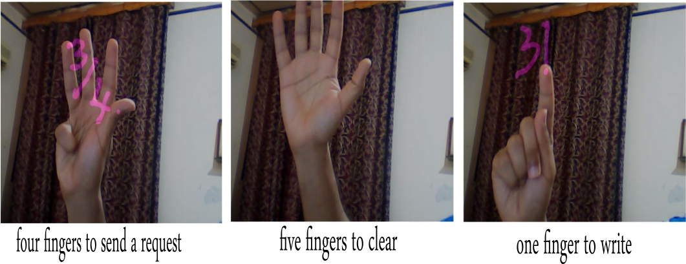

# Math solver problems based on finger tracking using Mediapipe and LLM Google Gemini
This project is based on the media pipe library, open CV, and generative.ai google gemini. You can write a math equation on canvas using one finger and send it to the LLM Gemini to receive a response.

How do I interact with the project:
-  Use your finger to write the math equation.
-  To send the input to Gemini, raise all the fourth fingers.
- To erase the canvas raise all five fingers

You should first install all the following libraries:

- pip install opencv
- pip install mediapipe
- pip install cvzone
- pip install -q -U google-generativeai
- pip install streamlit

### all available hand gestures

### video explanation
https://www.youtube.com/watch?v=O_W8h15scLM
